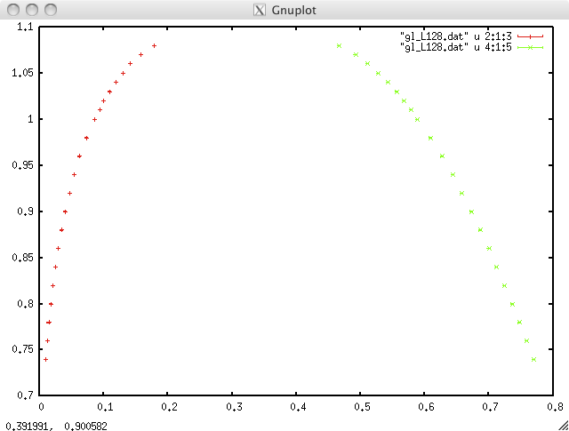

# Gas-Liquid Phase Boundary of Lennard-Jones System

## Summary

This data provides temperature Gas-Liquid Phase Boundary of Lennard-Jones System. Cutoff is 3.0 sigma. Please refer our paper for details.

## Data

[ljphasediagram.zip](ljphasediagram.zip)

Each file contains 7 columns, temperature, density of gas, its err, density of liquid , its err, lambda (thickness of gas-liquid phase interface), its err, respectively.

File name corresponds to the system size, e.g, `gl_L128.dat` is the data of the system with (128, 128, 256), etc.

If you have gnuplot, then you can plot gas-liquid binodal line as follows,

```txt
p "gl_L128.dat" u 2:1:3 w e,"gl_L128.dat" u 4:1:5 w e
```

It will give you the following graph.



## Reference

See the following paper for the details of the simulation.

* Phase diagram and universality of the Lennard-Jones gas-liquid system
    * Hiroshi Watanabe, Nobuyasu Ito, and Chin-Kun Hu
    * [J. Chem. Phys. 136 204102 (2012)](https://doi.org/10.1063/1.4720089)
    * [arXiv:1109.0821](https://arxiv.org/abs/1109.0821)

## LICENSE

CC-BY
